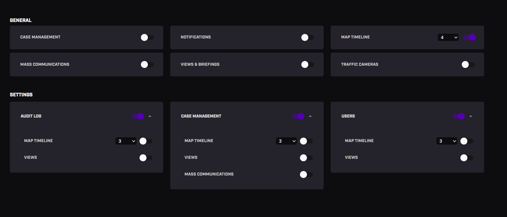

# 👷🏻 The project

This is a feature Flag UI
The main purpose of the app is for the user to manage features and account limits.

# 🤳🏻 General features

- Toggles either sit in a group or their own
- If a parent toggle is enabled, the child toggles should be expanded and displayed
- If a parent toggle is disabled, the child toggles should be disabled and then collapsed

# 🧑🏻‍💼 Admin features

...

# 🚀 Technologies

These are the technologies used:

- <a href="https://nextjs.org/" target="_blank">NextJS</a> <br>
- <a href="https://pt-br.reactjs.org/docs/getting-started.html" target="_blank">ReactJS</a> <br>
- <a href="https://www.typescriptlang.org/docs/" target="_blank">TypeScript</a> <br>

# 💻 Testing the application

To run the project locally you will need to follow some instructions. <br>

It`s necessary <a href="https://nodejs.org/en/download/" target="_blank">NodeJS</a> installed on your machine. <br>
You will also need <a href="https://classic.yarnpkg.com/lang/en/docs/install/#mac-stable" target="_blank">Yarn</a> ou <a href="https://www.npmjs.com/" target="_blank">Npm</a> to install packages. <br>

## Cloning the repository

```
  git clone https://github.com/carol-lima/flag-ui.git
```

## Install all packages

- Using Npm

```
  npm install
```

- Using o Yarn

```
  yarn install
```

## Getting Started

First, run the development server:

- Using Npm

```
  npm run dev
```

- Using Yarn

```
  yarn dev
```

Feature page:

```
http://localhost:3000/settings
```

---

<div align="center">
  <p>☎️<p> <br>
  <a href = "mailto:carollima.dev@gmail.com"></a>
  <a display="flex" text-align="center" href="https://www.linkedin.com/in/carollimadev/" target="_blank"></a> 
</div>
